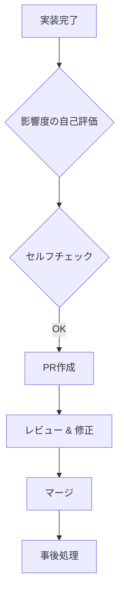

# PR運用ガイドライン (PR_WORKFLOW.md)

この文書は、本プロジェクトにおける Pull Request (PR) を起点とした開発フローと、品質・ドキュメントの整合性を維持するための具体的な工程を定義します。

## 1. ワークフロー概要

---

## 2. 工程詳細

### 2.1 実装完了 〜 影響度評価

実装が完了したら、まず変更の影響度を以下の3段階で評価してください。

| 影響度   | 定義・対象                                                                                         | 必要なアクション                                                                       |
| :------- | :------------------------------------------------------------------------------------------------- | :------------------------------------------------------------------------------------- |
| **LOW**  | **単独** 単一のファイルやコンポーネントのみに閉じた変更。                                       | 通常のセルフチェックとPR作成。                                                         |
| **MID**  | **関連箇所の確認が必要** 共通関数やスキーマの変更など、他のモジュールへの影響が予想される変更。 | 関連するドキュメント（`PATTERNS.md` 等）の更新と、波及箇所の動作確認。                 |
| **HIGH** | **網羅的な確認が必要** アーキテクチャの変更、重要なビジネスルールの追加、広範囲の定数変更など。 | **ADR (Architectural Decision Record) の作成**。全ドキュメントを精査し、整合性を確保。 |

### 2.2 具体作業フロー（ドキュメント駆動）

実装からコミットに至るまで、以下の手順を推奨します。

1.  **ドキュメントの先行更新**:
    - 実装内容に合わせて、まず `DOMAIN.md` (ルール) や `ARCHITECTURE.md` (設計) を更新します。
2.  **実装と内容の突き合わせ**:
    - AIに対し、「現在の実装内容と更新したドキュメントに不整合がないか」を確認させます。
3.  **検証（テスト・ビルド）**:
    - `npm run dev` や既存の手動テストを行い、動作を確認します。
4.  **Git コミット**:
    - 確認が完了したら、`git commit` を行います。

### 2.3 PR作成前（セルフチェック）

PRを作成する前に、影響度に応じた項目を確認してください。

1.  **ビルド・テスト確認**:
    - `npm run dev` でエラーが出ないこと。
    - 既存のテスト（手動テスト項目含む）をパスしていること。
2.  **ドキュメント整合性チェック**:
    - AIスキル `validate-docs` を実行し、ドキュメント間の矛盾がないか確認してください。
    - ソースコードの変更に伴い、`DOMAIN.md` や `ARCHITECTURE.md` に修正が必要な場合は反映してください。
3.  **コミットメッセージ**:
    - `AGENTS.md` に従い、Conventional Commits 形式（`feat:`, `fix:`, `docs:` 等）であることを確認してください。
4.  **影響度に応じた成果物**:
    - 影響度が **HIGH** の場合、`docs/06-reference/adr/` に決定事項（ADR）が作成されているか確認してください。

### 2.2 PR作成

GitHub（またはローカルの管理ツール）でPRを作成します。

- **Issueの紐付け**: 説明文に `Closes #<Issue番号>` を記載し、マージ時にIssueが自動で閉じるようにします。
- **変更内容の要約**: 何を変更したか、なぜ変更したかを簡潔に記載します。

### 2.3 レビュー & 修正（品質向上）

レビュー工程では、積極的なフィードバックとAIスキルの活用を推奨します。

- **AIによるレビュー**:
  - `PR Review` スキルを活用し、コードの品質やセキュリティ上の懸念を事前に洗い出します。
- **修正と同期**:
  - 指摘に基づきコードを修正した場合、AIスキル `sync-code-to-docs` を使用して、最新の実装状態をドキュメントに同期させてください。

### 2.4 マージ

レビューアの承認後、マージを行います。

- **マージ手法**: 原則として **「Create a merge commit」** を使用します。これにより、作業ブランチの履歴を保持したまま `main` に合流させます。
- **注意点**: マージ後に `git branch --merged` で合流が確認できるため、管理がより直感的になります。

### 2.5 事後処理（マージ後）

マージが完了したら、以下の作業を忘れずに行ってください。

1.  **TODO.md の更新**:
    - 完了したタスクにチェック `[x]` を入れます。
2.  **CHANGELOG.md の更新**:
    - 変更内容を記録します。
3.  **作業ブランチの削除**:
    - `git branch -d <branch-name>` でローカルブランチを整理します。
4.  **ace-playbook.md (ナレッジベース) の更新**:
    - 開発中に得られた技術的な知見、ハマりどころ、AIへの効果的な指示（プロンプト等）がある場合、`docs/08-knowledge/ace-playbook.md` に追記してください。
5.  **ドキュメントの最終同期**:
    - マージ後の `main` ブランチでもう一度 `validate-docs` を行い、全体としての整合性が保たれているか確認します。

---

## 3. 使用する主要ツール・スキル

| タイミング     | 使用ツール / スキル | 目的                           |
| :------------- | :------------------ | :----------------------------- |
| **PR作成前**   | `validate-docs`     | ドキュメントの整合性確認       |
| **レビュー中** | `PR Review`         | コード品質の客観的評価         |
| **修正時**     | `sync-code-to-docs` | 実装とドキュメントの不一致解消 |
| **マージ後**   | `ace-playbook.md`   | 次回開発に活かす知見の蓄積     |
| **マージ後**   | `CHANGELOG` 生成    | 変更履歴の自動/手動記録        |

---

## 4. セットアップ（初回のみ）

### 4.1 GitHub CLI (gh) のログイン

PRの作成やレビュー取得を自動化するために、以下の手順でログインを行ってください。

1.  ターミナルで `gh auth login` を実行。
2.  `GitHub.com` > `HTTPS` > `Yes` > `Login with a web browser` を選択。
3.  表示された 8 桁のワンタイムコードをコピー。
4.  エンターキーを押し、ブラウザでコードを貼り付けて承認。

---

> [!TIP]
> **ドキュメントは「生き物」です**
> コードだけを正しくしても、ドキュメントが古いままでは次回の開発でAIが誤った前提に基づいた提案をしてしまいます。PRごとに「コードとドキュメントはセットで納品する」意識を持ってください。

---

## 5. 【実践チートシート】AIと協働する具体的フロー
※具体的なAIへのプロンプト例やハンズオン手順については、別冊の **[AI協働チートシート](../99-memo/ai-workflow-cheatsheet.md)** を参照してください。
