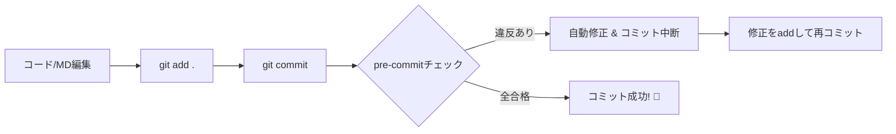

# pre-commitフレームワークによる自動化基盤（完了レポート）

本プロジェクトでは、`pre-commit` フレームワークを活用し、コード品質の維持とドキュメント管理の自動化を実現しました。

## 1. 導入したツールと役割

| ツール             | 役割                   | 備考                                                           |
| :----------------- | :--------------------- | :------------------------------------------------------------- |
| **pre-commit**     | Gitフック管理基盤      | Python製。多言語対応・環境隔離が可能。                         |
| **prettier**       | コード整形             | `.md` 以外を対象に、共通ルール (`.prettierrc.js`) で自動整形。 |
| **eslint**         | 静的解析               | JS/TSのエラーチェックと自動修正 (`--fix`)。                    |
| **commitlint**     | コミットメッセージ検証 | Conventional Commits (`feat:`, `fix:` 等) の強制。             |
| **独自スクリプト** | Markdown日付更新       | `updated: YYYY-MM-DD` をコミット時に今日の日付へ自動置換。     |
| **conv-changelog** | CHANGELOG生成          | 規約に沿ったコミットから `CHANGELOG.md` を自動更新。           |

## 2. 運用フロー



### 自動修正が入った時の対応
ツール（Prettier等）によってファイルが自動修正された場合、Gitは「未ステージの変更がある」と判断し、コミットを一度中断します。
その場合は、**再度 `git add .` をしてから `git commit` を実行** してください。

## 3. 便利なコマンド

- **全ファイルの一括チェック**
  ```powershell
  pre-commit run --all-files
  ```
- **CHANGELOGの生成・更新**
  ```powershell
  npm run changelog
  ```

## 4. 注意事項

- **Markdownの日付更新**: ファイル冒頭に `updated: YYYY-MM-DD` という記述がある場合のみ自動更新されます。
- **新規環境でのセットアップ**:
  1. `pip install pre-commit`
  2. `npm install`
  3. `pre-commit install`
  4. `pre-commit install --hook-type commit-msg`
