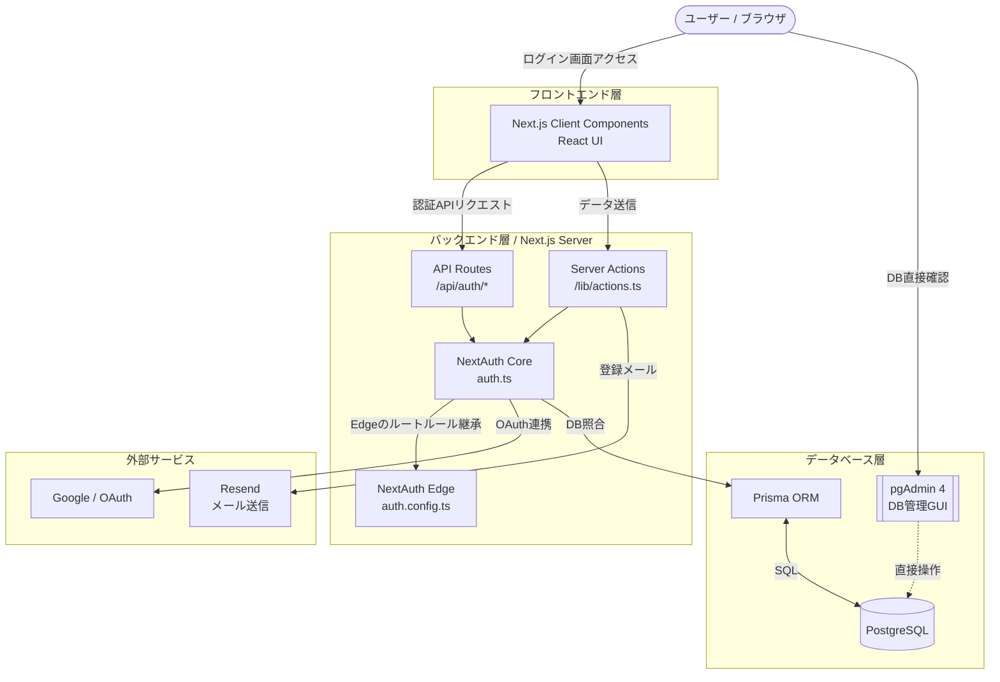

# システム構成メモ

現在のログイン機能開発プロジェクトにおけるシステム構成（アーキテクチャ）の全体像です。

## 全体構成図 (Mermaid)



## 各コンポーネントの役割

1. **Next.js (App Router)**
   - フロントエンドのUIコンポーネント描画と、サーバー側での処理（Server Actions）を両立。

2. **NextAuth.js (Auth.js v5)**
   - 認証の心臓部。
   - `auth.config.ts`：ミドルウェア（Edge Runtime）で動く軽量なルート保護を担う。
   - `auth.ts`：Node.js用にPrismaやbcryptなどの重い処理を包含し、実際のログイン照合やプロバイダー管理を担う。

3. **Prisma & PostgreSQL**
   - **Prisma**: 型安全にDB操作を行うためのORM。NextAuthとDBの橋渡し（Prisma Adapter）としても機能する。
   - **PostgreSQL**: ユーザーやセッション情報を保存する本体。
   - **pgAdmin**: 開発時におけるPostgreSQLのGUI（グラフィカル）管理ツール。生のSQLを打つことなくテーブルを視覚的に管理する。

4. **外部サービス (今後の拡張含む)**
   - **Google**: OAuthを用いたソーシャルログインプロバイダー。
   - **Resend**: 新規登録やパスワードリセットなどの確認メール送信サービスとして利用予定。

---

## 簡易版：3層アーキテクチャ図 (High-Level)

細かいコンポーネントを省き、「フロントエンド」「バックエンド」「データベース」という3つの大きな層（Tier）で捉えたシンプルな構成図です。頭を整理する際はこちらを参照してください。

```mermaid
flowchart LR
    %% ノード定義
    User([ユーザー])
    
    subgraph Frontend [第1層: フロントエンド]
        UI["画面表示 / UI<br>(Next.js Client)"]
    end
    
    subgraph Backend [第2層: バックエンド]
        Logic["ビジネスロジック<br>(Next.js Server)"]
        Auth["認証システム<br>(NextAuth)"]
    end
    
    subgraph Database [第3層: データベース]
        DB[("データ保存<br>PostgreSQL")]
    end

    %% リレーション
    User <-->|操作 / 閲覧| UI
    UI <-->|API / Server Action 通信| Logic
    UI <-->|ログイン要求| Auth
    
    Logic <-->|データ読み書き (Prisma)| DB
    Auth <-->|セッション管理・照合| DB
```
